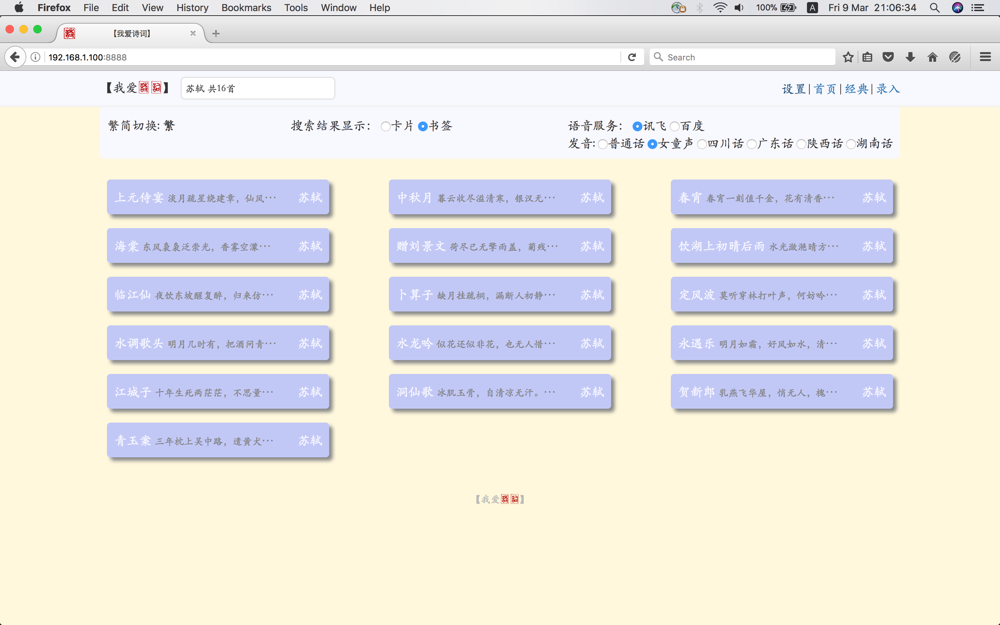
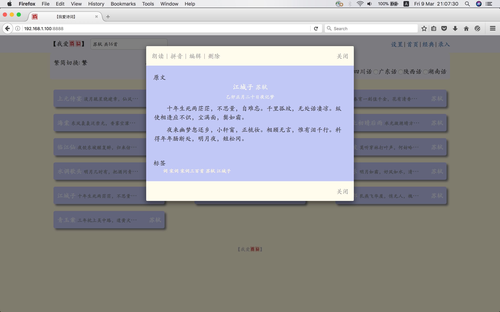
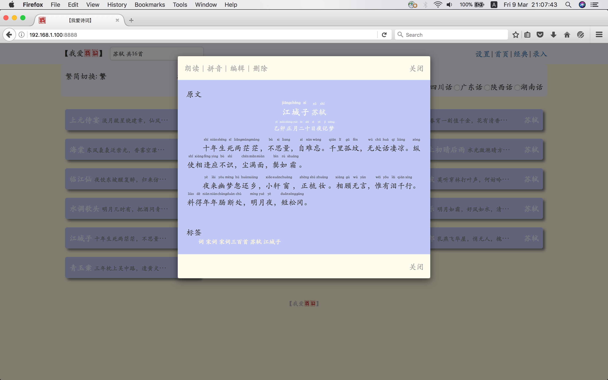

欢迎来到【我爱诗词】
==========================
【我爱诗词】是开源的中国古诗词学习网站。已经收录唐诗三百首、宋词三百首和千家诗共约八百余首经典诗词。后续还将加入更多经典，特别是适合青少年的内容。

### 【我爱诗词】的由来 
2016年底有一段闲暇时间较多，为方便背诵唐诗，找了一些诗词网站和程序。但没有找到一款我期望的界面简约、干净，操作便捷、符合触屏特点的网站或程序。有些只是简单纸质书籍的复印，有些界面凌乱，充斥着各种广告。于是有了写一款程序的想法。
Web程序算是第二次写吧，第一次是约二十年前写的CGI和HTML页面。可以说是完全菜鸟水平，请朋友们多指点。

### 功能
* 诗词朗读：利用讯飞和百度的语音合成，可以朗读完整的诗词。讯飞还支持数种方言。
* 拼音标注：在显示诗词原文的同时显示拼音，方便学龄青少年诵读，和成人对一些生僻字的学习。
* 注释：注释显示在原文下面，哪里不懂点那里，缺省不显示。
* 搜索方便：搜索关键字可以是作者姓名、诗词名称、体裁、作品集名称或者诗词片段。

### 下载
```
git clone https://github.com/shuguangbo/shici.git
```

### 安装方式
* 网络服务版
```
pip install -x requirements.txt
python shici.py
```
* 文件版
```
直接在浏览器中打开shici.html
```   

### 使用方法
* 点击经典会随机显示一首诗或词。
* 在搜索框中填写关键词搜索你想读的诗词。可以是诗词名称，作者姓名，诗词片断，诗词体裁如五言绝句，七言绝句，五言律诗，七言律诗，木兰花等，或者作品集名称如唐诗三百首，宋词三百首，千家诗等。搜索结果以贴片或列表的方式显示，点击显示完整的诗词原文和赏析，点击诗词的每一行则显示相应的注释。
### 页面快照
* 搜索结果页面

* 作品详细展示页面

* 作品详细展示页面，同时显示拼音

### 已知问题
* 多音字拼音错误：已有的拼音是通过软件自动标注，在多音字处理上还不完善。需要后期人工校验，这需要大量的精力，还在继续进行中。
* 多音字朗读错误：各家的语音合成都还不能完美解决多音字发音问题...
* 注释和赏析不全：这是最重要，也是最费精力和时间的工作 ...
* 手机端导航显示异常：布局采用flex，然而大多安卓上的浏览器不支持flex，可以尝试公版Firefox。正在解决 ...
* 百度语音合成不能使用：百度语音的Restful接口有时间限制，已过期。
* 文件版朗读功能不能用：原因不明。

### 问题反馈
有问题请报issues或发邮件至1262448230@qq.com。

### 志愿者招募
后续的完善需要更多的精力投入，文字方面的工作包括文字较对，诗词录入，编写注释、赏析；软件方面的工作包括前后端界面优化完善，APP的开发。期待大家加入，有意者请致信1262448230@qq.com或者微信联系guangboshu，请注明【我爱诗词】。
